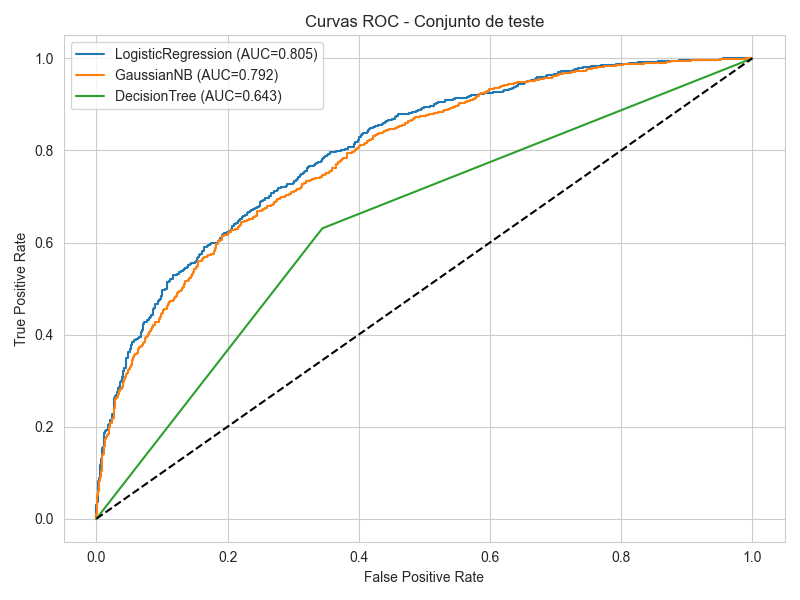

# Projeto Final – Previsão de Resultados em Partidas de League of Legends (LoL)

> Projeto desenvolvido como entrega final do curso **Profissão Cientista de Dados – EBAC**.  
> Caso escolhido: **Previsão do Vencedor em Partidas de League of Legends (LoL)**.  
> Solicitante: *Tech Lead da Riot Games* (material fornecido pela EBAC).

## Objetivo do Projeto
Criar um **modelo de Machine Learning** capaz de prever, nos primeiros minutos de partida, **qual time tem maior probabilidade de vencer** — *time azul (blueWins = 1)* ou *time vermelho (0)* — utilizando métricas pós-início de jogo, como:

- Abates, assistências e mortes  
- Objetivos: Torres, Dragões, Arautos, Monstros Épicos  
- Wards posicionadas e destruídas  
- Vantagem de ouro  
- Eventos iniciais (ex.: *First Blood*)

Esse tipo de solução pode apoiar:
- Ferramentas de **matchmaking e balanceamento**
- **Revisão tática** por equipes competitivas
- **Plataformas internas de análise** da Riot Games

## Estrutura do Repositório
```
├── data/
│   ├── Base_M43_Pratique_LOL_RANKED_WIN.csv
│   ├── data_describe.csv
│   ├── target_distribution.csv
│   ├── missing_values.csv
│
├── outputs/
│   ├── LogisticRegression_pipeline.joblib
│   ├── GaussianNB_pipeline.joblib
│   ├── DecisionTree_pipeline.joblib
│   ├── DecisionTree_best_pipeline.joblib
│   ├── LogisticRegression_confusion_matrix.csv
│   ├── GaussianNB_confusion_matrix.csv
│   ├── DecisionTree_confusion_matrix.csv
│   ├── models_summary.csv
│   ├── roc_curves.png
│   ├── predictions_logistic.csv
│   ├── predictions_nb.csv
│   ├── predictions_tree.csv
│   ├── predictions_tree_best.csv
│
├── src/
│   ├── lol_pipeline.py
│   ├── infer_logistic.py
│   ├── infer_nb.py
│   ├── infer_tree.py
│
├── report/
│   ├── relatorio_projeto_LoL.pdf
│   ├── apresentacao_relatorio_lol.pdf
│
└── README.md
```

## Entendimento do Problema
Segundo o *briefing do stakeholder*, a Tech Lead da Riot Games descreve a necessidade de:

> *Um modelo confiável que consiga, logo nos primeiros minutos da partida, inferir qual time possui maior probabilidade de vencer, permitindo análises estratégicas e melhorias nos sistemas competitivos.*  

O dataset disponibilizado contém métricas essenciais sobre os dois times durante o início de jogo, e a variável target é **blueWins** (1 = time azul vence).

Trecho do relatório oficial:

> *"Cada decisão tomada nos primeiros minutos de jogo pode alterar drasticamente o rumo da partida, como conquista de objetivos ou vantagem de ouro."*

O dataset inclui métricas essenciais como:
- Abates, assistências e mortes
- Objetivos (torres, dragões, arautos, monstros épicos)
- Ouro total
- Eventos iniciais como First Blood

## Preparação e Engenharia de Atributos
Realizada pelo módulo **lol_pipeline.py**, incluindo:

- Criação de *diferenças blue − red* para cada métrica
- Criação de **first_blood_flag**
- Remoção de colunas redundantes
- Padronização e imputação com ColumnTransformer

> *"Foi construído um pipeline determinístico que calcula diferenças, gera indicadores e remove variáveis redundantes."*

## Análise Exploratória (EDA)
Arquivos incluídos:
- `data_describe.csv`
- `target_distribution.csv`
- `missing_values.csv`

## Modelagem
Três modelos foram treinados:

| Modelo                 | Test AUC | Test Accuracy |
|-----------------------|----------|----------------|
| **Logistic Regression** | **0.8047** | **0.7161** |
| Gaussian Naive Bayes | 0.7915   | 0.7085 |
| Decision Tree         | 0.6432   | 0.6432 |

A regressão logística foi o melhor modelo.

> *"A regressão logística demonstrou o melhor desempenho, com equilíbrio entre interpretabilidade, velocidade e estabilidade estatística.”*

## Curvas ROC


> As curvas ROC mostram superioridade da regressão logística (AUC ~0.805), seguida por GaussianNB. A decisão por DecisionTree se mostrou inferior por apresentar alta variância e pouca capacidade discriminativa.

## Interpretação dos Resultados
Principais insights:
- Objetivos (torres, dragões, arautos) são altamente preditivos.
- Ouro é a métrica mais consistente.
- First Blood tem impacto menor quando analisado isoladamente.
- O *macro* importa mais do que eventos isolados.

> *“Diferenças em objetivos (torres, dragões, arautos) e vantagem de ouro são os fatores com maior poder discriminativo. First Blood possui impacto isolado menor.”*

Isso reforça observações conhecidas no cenário competitivo de LoL.

## Uso dos Pipelines de Inferência

### Regressão Logística
```
python infer_logistic.py --data_path data/Base_M43_Pratique_LOL_RANKED_WIN.csv --output_path resultados_logistic.csv
```

### GaussianNB
```
python infer_nb.py --data_path data/Base_M43_Pratique_LOL_RANKED_WIN.csv --output_path resultados_nb.csv
```

### Decision Tree
```
python infer_tree.py --data_path data/Base_M43_Pratique_LOL_RANKED_WIN.csv --output_path resultados_tree.csv
```

Os scripts:
- carregam o modelo (`*.joblib`)
- aplicam a mesma feature engineering
- geram `pred` e `proba`

## Entrega Final
Inclui:
- Modelos treinados `.joblib`
- Pipelines de inferência
- Matrizes de confusão
- Predições
- Artefatos de EDA

## Conclusão
O projeto entregou:
- Um pipeline completo e replicável
- Modelo de alta interpretabilidade
- Métricas fortes (AUC > 0.80)
- Scripts funcionais para inferência
- Documentação técnica e relatório profissional
- Visualizações de apoio (ROC, métricas etc.)

## Próximos Passos
- Incluir dados temporais por minuto
- Testar LightGBM e XGBoost
- Criar dashboards interativos

## Autor
**Marcel Sarcinelli Pimenta**  
Projeto Final – Profissão Cientista de Dados – EBAC
